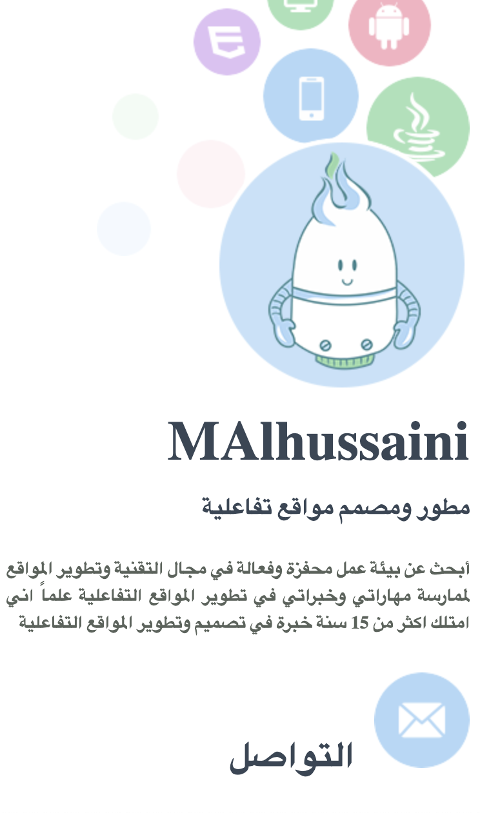
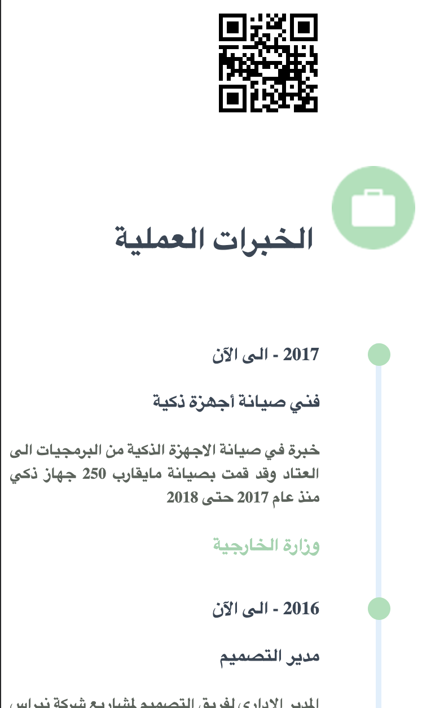
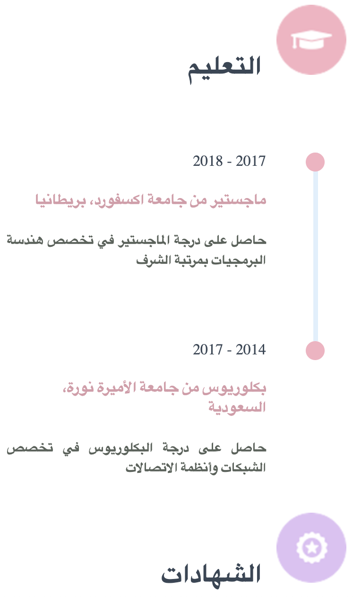
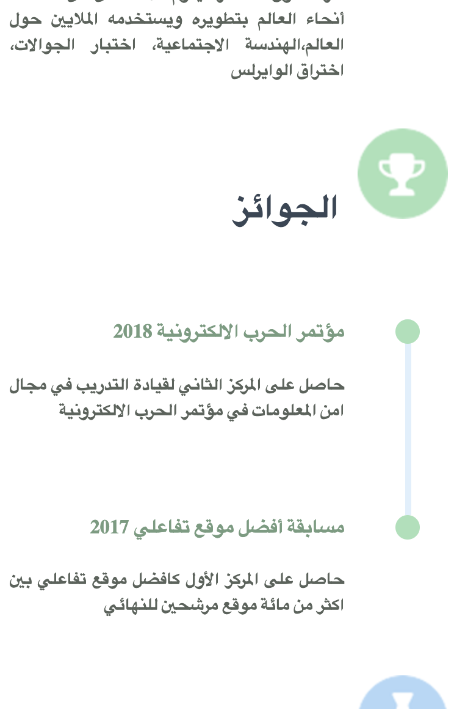

     

## What's Web CV ?
<b>
   ‫
   ‫سيرة ذاتية احترافية ويب HTML5, CSS3 بتصميم مرن Respnsive Design مناسبة لجميع أحجام الشاشات تحتوي على المعلومات الأساسية، التعليم، الشهادات، الخبرات، المهارات ... ويمكنك الإضافة والتعديل عليها مفتوحة المصدر من تصميم وتطوير <a href="https://nebrasapps.com">فريق نبراس </a>
    
  زد فرصك الوظيفية بإبداعك في سيرتك الذاتية مجاناُ للجميع
</b>  

## Screenshots 

<b>

     
     
     
     
     
     
    

## About Alhussaini 

  <b></b>

  

<b>
شركة رائدة في التقنيات الحديثة والمتطورة في حلول وتطبيقات الويب والأجهزة الذكية📱💻 التي تعمل على كل المنصات مثل الأندرويد، الايفون، الويندوز وغيرها. بالإضافة الى تطوير أجهزة وأنظمة تخدم مجال إنترنت الأشياء والحوسبة السحابية. إن خبراءنا الذين يعملون بشغف بإمكانهم تحقيق رؤيتكم و مشاريعكم التقنية في مجالات مختلفة ومشاركتكم النجاح. 
رؤيتنا تتجه نحو تقديم خدمة تقنية متطورة عالية الجودة لمواكبة التطور السريع في العالم التقني ورسالتنا توفير أحدث التقنيات في الاسواق العالمية وإعادة رسم الافكار لتوفير أفضل الحلول.
</b>

   

   
Original source www.nebrasapps.com

